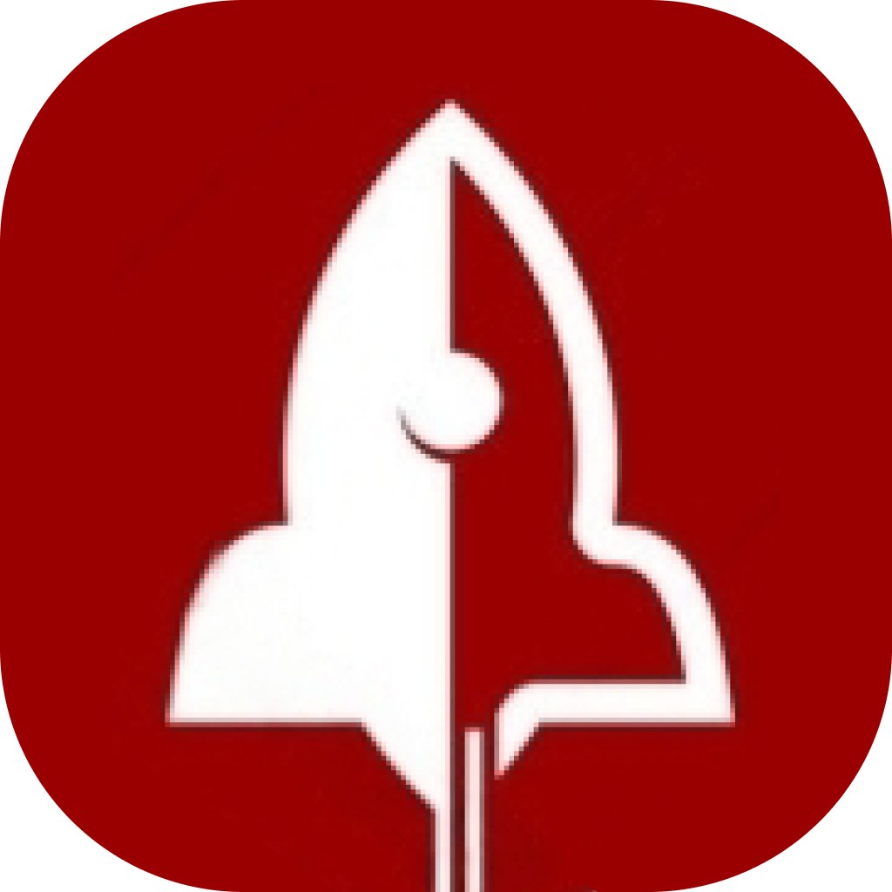
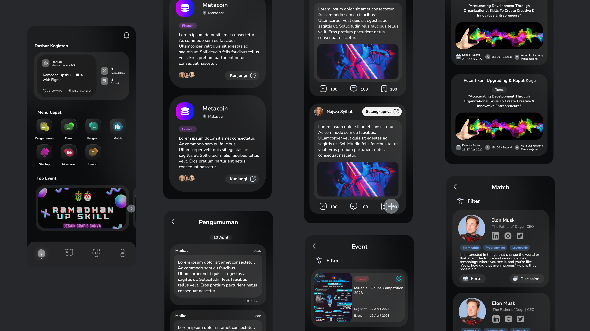

  <h1>Startup Unhas</h1>
  
<b>Unofficial Startup Unhas Application</b>

 

## UIUX Design

Click on image or **[`here`](https://www.figma.com/file/Qri2T0jDeLZODofvr9Wgv1/%231-Startup-UH?node-id=16%3A323&t=5JW7obGk0YigjTzV-1)** to see in Figma.
